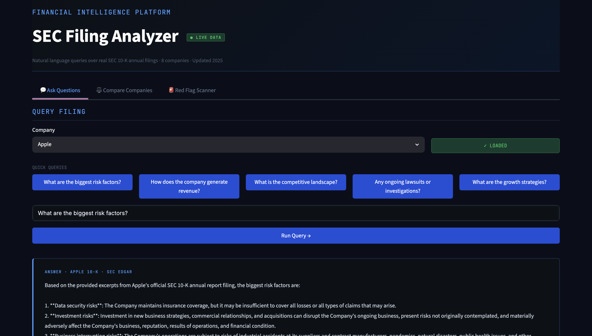
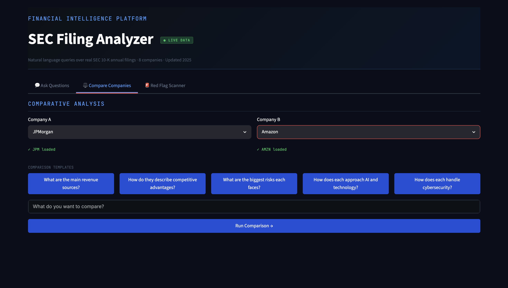
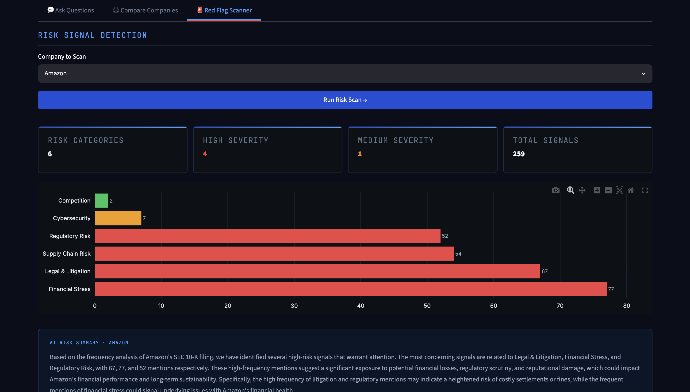

#  SEC Filing Analyzer — Financial Intelligence Platform

> Natural language analysis of real SEC 10-K annual filings using RAG + LLM. Ask questions, compare companies and detect risk signals — all powered by live SEC EDGAR data.


## Screenshots

### Ask Questions


### Compare Companies


### Red Flag Scanner

---

#  What This Does

Most financial analysis tools either cost thousands of dollars (Bloomberg Terminal) or rely on outdated Kaggle datasets. This platform pulls **real, live 10-K filings directly from the SEC EDGAR API** and makes them queryable in plain English using a production-grade RAG pipeline.

**You can:**
- Ask *"What are Tesla's biggest risk factors?"* and get a cited answer from the actual filing
- Compare *"How do Apple and Microsoft describe their competitive advantages?"* side by side
- Automatically scan any filing for risk signals — litigation, cybersecurity, supply chain, regulatory exposure

---

#  Architecture

---

#  Features

#  Ask Questions
Natural language queries over any loaded 10-K filing. The system retrieves the most semantically relevant excerpts and synthesizes a grounded answer using Llama 3.1.

# Compare Companies
Side-by-side analysis of two companies on any dimension — revenue model, risk factors, competitive strategy, AI approach, cybersecurity posture.

# Red Flag Scanner
Automated detection of 7 risk signal categories across every filing:
- Legal & Litigation
- Regulatory Risk
- Supply Chain Risk
- Cybersecurity
- Financial Stress
- Competition
- Going Concern

Each category is scored HIGH / MEDIUM / LOW by mention frequency, visualized as a bar chart and summarized by the LLM.

---

# Supported Companies

| Ticker | Company |
|--------|---------|
| AAPL | Apple |
| MSFT | Microsoft |
| JPM | JPMorgan Chase |
| TSLA | Tesla |
| GS | Goldman Sachs |
| AMZN | Amazon |
| GOOGL | Google |
| META | Meta |

---

# Tech Stack

| Layer | Technology |
|-------|-----------|
| Data Source | SEC EDGAR API (official US government filings) |
| Embeddings | `sentence-transformers/all-MiniLM-L6-v2` |
| Vector Store | FAISS (Facebook AI Similarity Search) |
| LLM | Llama 3.1 8B via Groq API |
| Frontend | Streamlit |
| Visualization | Plotly |
| Language | Python 3.11 |

---

# Getting Started

1. Clone the repo
```bash
git clone https://github.com/ManyaEleti/sec-filing-analyzer.git
cd sec-filing-analyzer
```

2. Create virtual environment
```bash
python -m venv venv
source venv/bin/activate
```

3. Install dependencies
```bash
pip install numpy==1.26.4
pip install torch==2.2.2
pip install sentence-transformers==2.7.0
pip install -r requirements.txt
```

4. Set up environment variables
```bash
echo "GROQ_API_KEY=your_groq_api_key_here" > .env
```
Get a free Groq API key at [console.groq.com](https://console.groq.com)

5. Run the app
```bash
python -m streamlit run app.py
```

6. Load a company and start querying
- Select a company from the sidebar
- Click **"Load 10-K Filing"** (fetches live from SEC EDGAR)
- Ask questions, compare companies, or run the red flag scanner

---

#  Project Structure

---

# Why This Project

Every major financial institution — JPMorgan, Goldman Sachs, Bloomberg — is actively building internal tools to make SEC filings queryable with LLMs. This project demonstrates:

1. **Production RAG architecture** — not a toy chatbot but a real retrieval pipeline with semantic chunking, FAISS indexing and grounded generation
2. **Real financial domain knowledge** — understanding of 10-K structure, risk factors, XBRL metadata filtering
3. **End-to-end ML engineering** — data ingestion → embedding → retrieval → generation → deployed UI

---

# Author

**Lakshmi Manya Eleti**  
ML Engineer · MS Data Science, UMBC (Dec 2026)  
[LinkedIn](https://www.linkedin.com/in/lakshmi-manya-eleti-116142241/) · [GitHub](https://github.com/ManyaEleti)
